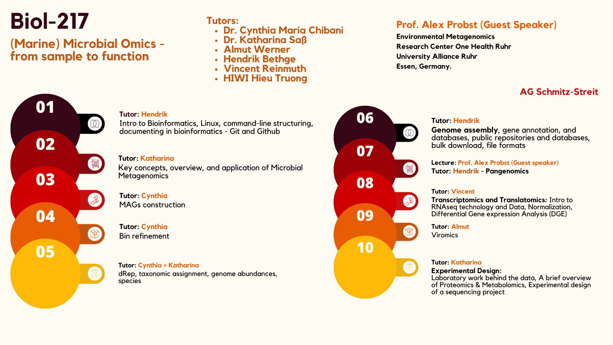

# Biol217-2026




## How to run interactive sessions  

High-performance computing allows you to process a large amount of data, but command-line interfaces traditionally have very limited graphical displays. In order to visualize _**and**_ interact with your data in feature-rich graphical applications like `anvi'o`, you would need an interactive graphical environment like the everyday computer. Luckily, the CAU cluster does have [interactive compute nodes](https://www.hiperf.rz.uni-kiel.de/caucluster/status/#slurm-partition-interactive) in its architecture, but in order to see and click on the graphics that these interactive nodes generate, you would have to be there in person, looking at a screen that is physically connected to the compute nodes. Unless you follow the instructions below:  


### Step 1 - Initiate an interactive session  

First, you need to [request computing resources](https://www.hiperf.rz.uni-kiel.de/caucluster/slurm/#interactive-batch-usage) from the cluster to run interactive processes. The interactive nodes are only accessible from within the CAU cluster, so after you log into your `sunam###` account, run:  

``` bash
srun --pty --x11 --partition=interactive --nodes=1 --tasks-per-node=1 --cpus-per-task=1 --mem=10G --time=01:00:00 /bin/bash
```

**Importantly**, write down which interactive node was allocated to you. When you run the command above, you will log into one of the interactive compute nodes as `sunam###@n###`. `n###` is the interactive node that the server allocated to you, and only it will display your results.  

This command also enables X11 forwarding, which allows graphical applications from a remote computer/server to be _forwarded_ to your own local computer. Here, the remote computer is the interactive compute node on the CAU cluster, and the "local" computer is the one that the account `sunam###` is using on the CAU cluster. If you logged into your `sunam###` account with `ssh -X`, then the graphical applications can be further forwarded from `sunam###`'s computer (on the CAU cluster) to the computer you are using right now in class.  


### Step 2 - Run your interactive processes  

These interactive processes include commands such as `anvi-display-contigs-stats` and `anvi-interactive`. Remember to activate the `anvi'o` environment, of course.  

``` bash
module load gcc12-env/12.1.0
module load micromamba
cd $WORK
micromamba activate .micromamba/envs/00_anvio/
```

The `anvi'o` interactive interface is built as a web application, so it will create a local web server to run the app. You will probably see an address like [http://127.0.0.1:8080/](http://127.0.0.1:8080/) being shown on the terminal. Since you are running interactive `anvi'o` from the interactive compute node `n###`, this web server is hosted on node `n###` and is local to node `n###` but is still remote to `sunam###` or to your own computer. Therefore, you now need to connect your local computer to this web server.  


### Step 3 - Connect to the interactive web server  

Since we initiated the interactive session with `srun`, the web server will be terminated as soon as we cancel the `srun` command. Thus, you have to connect to the `anvi'o` web server on node `n###` from a new terminal tab. Again, you will have to connect to `sunam###` first before having access to the interactive nodes.  

``` bash
ssh -L localhost:8080:localhost:8080 sunam###@caucluster.rz.uni-kiel.de
```

As `sunam###`, connect to node `n###` (both are part of the cluster):  

``` bash
ssh -L localhost:8080:localhost:8080 n###
```

Since we want to interact with the web app on node `n###` conveniently from the classroom, we need a way to _forward_ what we do with the web app locally to `sunam###` and then from `sunam###` to node `n###`. That is what the [`-L`](https://www.man7.org/linux/man-pages/man1/ssh.1.html) (local port forwarding) option does. The first `localhost:8080` is interpreted relative to the computer that initiates the `ssh` connection, while the second `localhost:8080` is interpreted relative to the remote `ssh` connection target. With the first `ssh` command, if a program/process talks to port `8080` on your classroom computer (such as a browser opening the `anvi'o` web app), that conversation will be forwarded to `sunam###` at port `8080`. With the second `ssh` command, if a process talks to port `8080` on `sunam###`, that conversation will then be forwarded to node `n###`.  

Once the connections are established, you can start playing around with the data by accessing [http://127.0.0.1:8080/](http://127.0.0.1:8080/). If port `8080` is busy, you can try port `8060` instead (`ssh -L localhost:8060:localhost:8060` then access [http://127.0.0.1:8060/](http://127.0.0.1:8060/)).  


## How to connect to the CAU cluster from home  

The CAU cluster can only be accessed by computers whose IP addresses are within the university network. Therefore, you must use a VPN client to make your personal device appear like a university computer. Just follow the instructions here: [de](https://www.rz.uni-kiel.de/de/tipps/vpn) or [en](https://www.rz.uni-kiel.de/en/hints-howtos/vpn17). Note: In order to access the CAU cluster, you will need to connect to the university network as `sunam###` instead of `stu######` (unless, of course, your `stu######` account has also been granted cluster access from other engagements). Once a VPN connection to the university network is in place, you can open your computer's terminal and log into your `sunam###` account as usual to run computations.  

For file transfers, you can use commands such as `scp`, `rsync`, and `sftp` (see [here](https://tecadmin.net/transferring-files-over-ssh/), for example). If you are more GUI-inclined, you can install graphical SSH/SFTP clients to browse files visually on remote servers. Some of them even let you perform drag-and-drop magic. Below are a few options you can try:  

+ Windows-only (unless with [Wine](https://www.winehq.org/)): [MobaXterm](https://mobaxterm.mobatek.net/), [WinSCP](https://winscp.net/eng/index.php) [Solar-PuTTY](https://www.solarwinds.com/free-tools/solar-putty)
+ Cross-platform: [Cyberduck](https://cyberduck.io/), [FileZilla](https://filezilla-project.org/?ref=sftptogo.com), [Termius](https://termius.com/)
+ Linux-specific: Nautilus (the default file manager of GNOME), Dolphin (the default file manager of KDE)


<!-- Comment begins - # Below is the old version of this file from 2025

## Here is how to use srun for ANVIO interactive:

### Displaying stuff
```
srun --pty --x11 --partition=interactive --nodes=1 --tasks-per-node=1 --cpus-per-task=1 --mem=10G --time=01:00:00 /bin/bash
```
`note down which node this command logged you on`

```
module load gcc12-env/12.1.0
module load micromamba
micromamba activate $WORK/.micromamba/envs/00_anvio/
```

`Run the command to display what you want`

Then open a new terminal
```
ssh -L 8080:localhost:8080 sunam###@caucluster.rz.uni-kiel.de
```
```
ssh -L 8080:localhost:8080 n#
```

http://127.0.0.1:8080/


Then close the connection with `ctrl c`
```
exit
```
# if the host is busy, try 8080 instead of 8060

http://127.0.0.1:8060/

Comment ends -->
